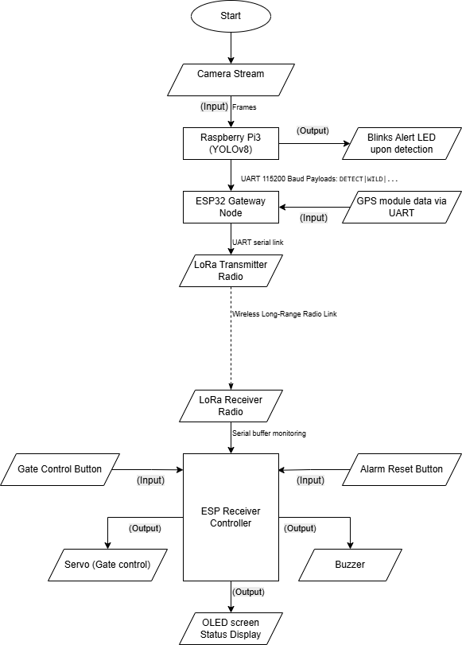
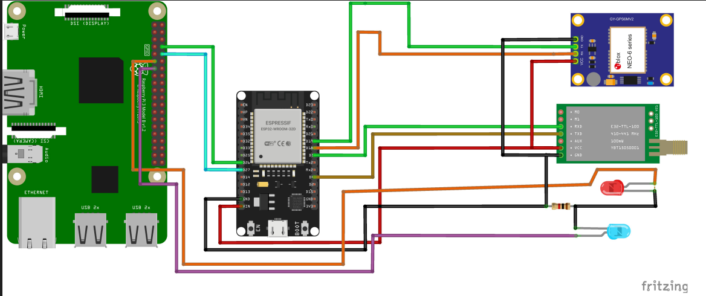
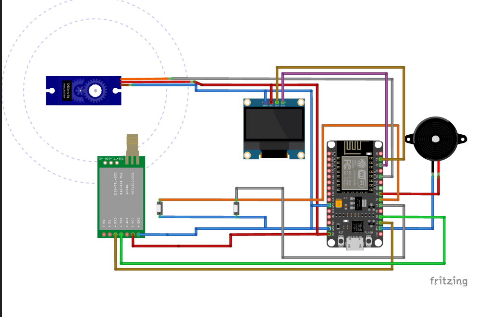
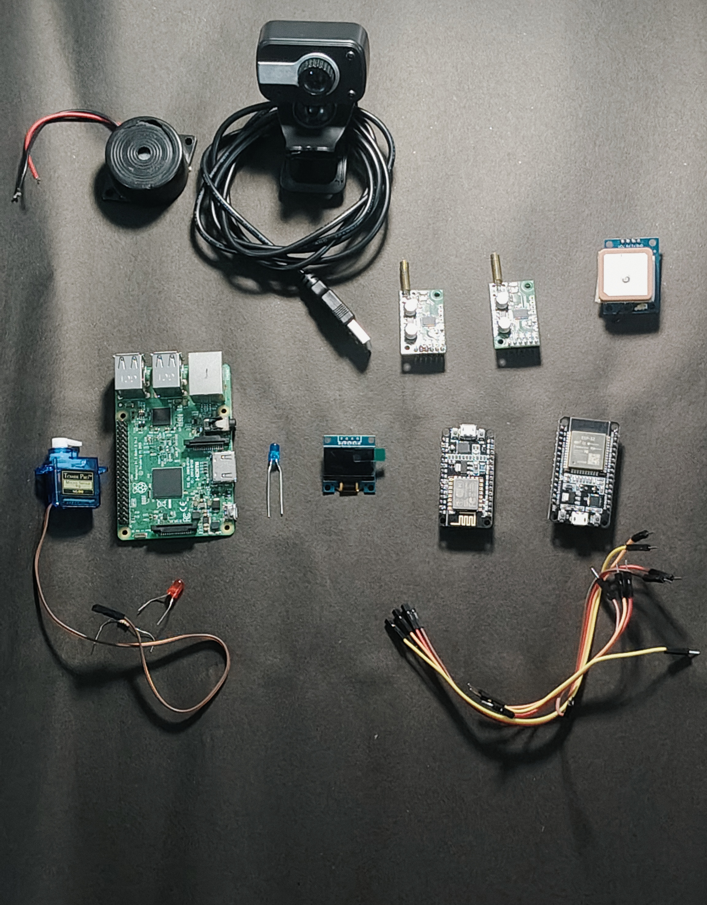
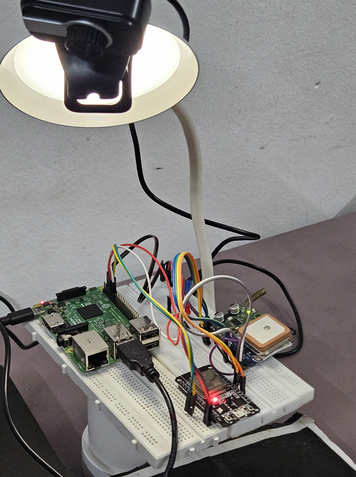
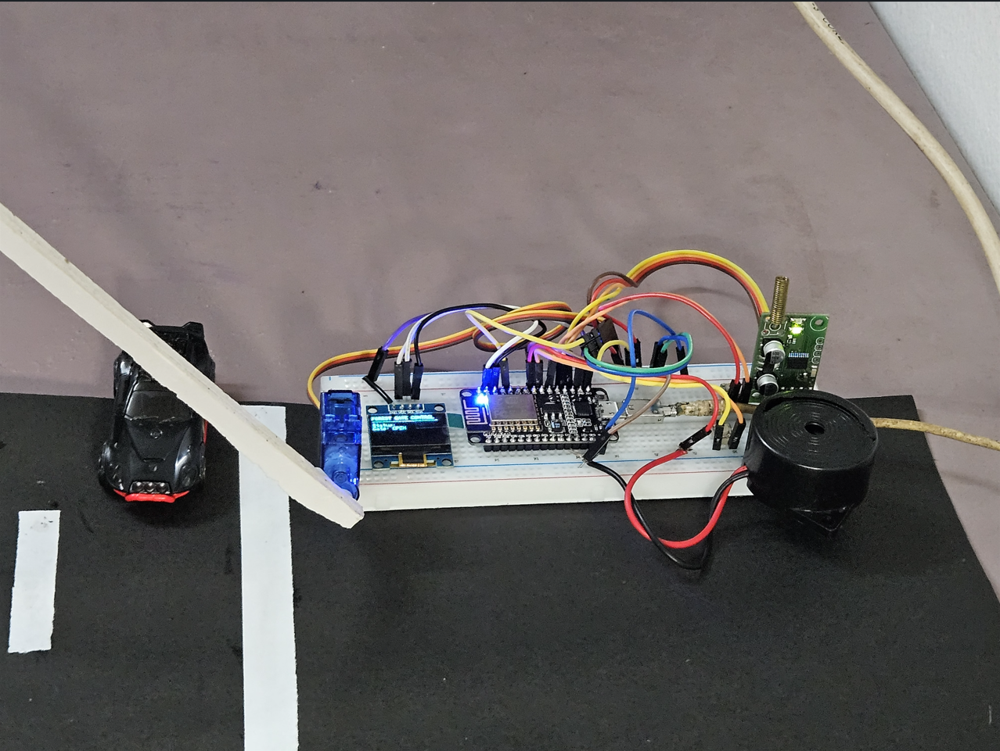
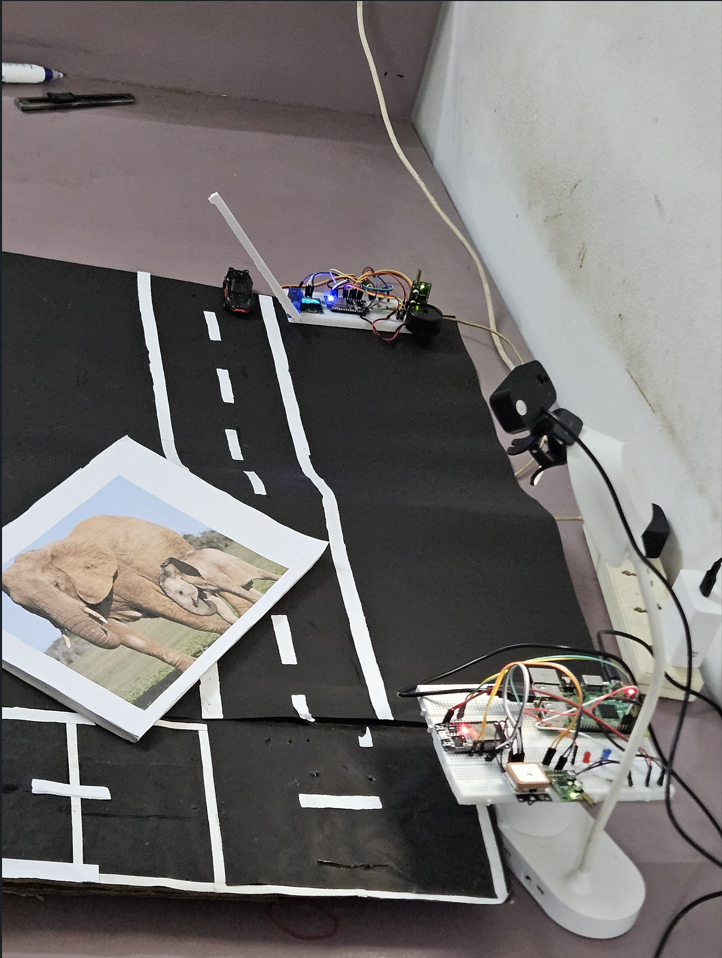

# Edge AI Based Intelligent Ghat Road Safety System for Wildlife Detection

<div align="center">


**Real-time Wildlife Detection & Alert System for Ghat Road Safety using Edge AI and LoRa Communication**

[](https://github.com/akshay-k5/Edge-AI-Based-Intelligent-Ghat-Road-Safety-System-for-Wildlife-Detection-)
[](https://github.com/akshay-k5/Edge-AI-Based-Intelligent-Ghat-Road-Safety-System-for-Wildlife-Detection-)

</div>

---

## Table of Contents
- [Overview](#overview)
- [Block Diagram](#block-diagram)
- [Problem Statement](#problem-statement)
- [Features](#features)
- [System Architecture](#system-architecture)
- [Hardware Requirements](#hardware-requirements)
- [Circuit Diagrams](#circuit-diagrams)
- [Practical Setup](#practical-setup)
- [Installation](#installation)
- [Usage](#usage)
- [Project Files](#project-files)
- [Message Protocol](#message-protocol)
- [Future Enhancements](#future-enhancements)
- [License](#license)

---

## Overview

An Edge AI-based intelligent safety system designed for ghat roads (mountain passes) that uses computer vision and artificial intelligence to detect wild animals in real-time. The system classifies animals as wild or domestic, tracks GPS location, and transmits instant alerts over long-range LoRa communication to a receiver station. This helps prevent wildlife-vehicle collisions on dangerous mountain roads.

---

## Block Diagram



---

## Problem Statement

Ghat roads (mountain passes) are prone to wildlife-vehicle collisions due to:
- Poor visibility on sharp curves
- Sudden animal crossings
- Lack of early warning systems
- Remote locations with no cellular connectivity

This system provides an early warning solution using Edge AI and LoRa communication.

---

## Features

### Core Functionality
- Real-time Animal Detection using YOLOv8 neural network
- Classification into Wild (Dangerous) and Domestic categories
- GPS Location Tracking with satellite fix status
- Long-range LoRa Communication (up to 5km) - no cellular needed
- Visual Alerts via LED indicators (Red=Wild, Orange=Domestic)
- Heartbeat System every 4 seconds for health monitoring
- Hardware Failure Detection and automatic reporting

### Reliability Features
- Automatic hardware health checks (GPS, Camera, LoRa)
- Duplicate message filtering (prevents spam)
- Graceful shutdown with notification
- GPS satellite search status reporting
- Message deduplication (30-second cooldown for identical messages)

### Communication Protocol
- Unified single-line message format
- Easy parsing on receiver end
- Timestamp and location with every message
- Hardware malfunction alerts

---

## System Architecture

```
EDGE NODE (Raspberry Pi 3) - Mounted at Ghat Road
├── 📷 Camera (USB Webcam)
│   └── YOLOv8 Object Detection (imgsz=160)
├── 🛰️ GPS Module (Software Serial)  
├── 📡 LoRa HPD13A v1.1 (Software Serial)   
├── 💡 LED Indicators 
└── 🔄 Background Threads
    ├── Status Loop (4-second heartbeat)
    ├── GPS Reader
    └── Alert Handler (Non-blocking)

RECEIVER STATION (ESP32) - At Check Post / Control Room
├── 📡 LoRa HPD13A v1.1 (Hardware Serial UART2)
├── 🖥️ Serial Monitor Display (115200 baud)
└── 🔔 Online/Offline Detection (15-second timeout)
```

---

## Hardware Requirements

### Edge Node - Raspberry Pi 3 (Ghat Road Mount)
| Component | Quantity | Specification |
|-----------|----------|---------------|
| Raspberry Pi 3 Model B+ | 1 | Main processing unit |
| USB Webcam | 1 | 320x240 or 640x480 resolution |
| GPS Module | 1 | NEO-6M/7M/8M (UART, 9600 baud) |
| LoRa Module | 1 | HPD13A v1.1 (433/868/915 MHz) |
| Red LED | 1 | 5mm with 220 ohm resistor |
| Orange LED | 1 | 5mm with 220 ohm resistor |
| Jumper Wires | ~20 | Male-Female |
| Power Supply | 1 | 5V 2.5A Micro USB |
| Weatherproof Enclosure | 1 | IP65 or higher |

### Receiver Station - ESP32 (Check Post / Control Room)
| Component | Quantity | Specification |
|-----------|----------|---------------|
| ESP32 Dev Board | 1 | DOIT DevKit v1 or similar |
| LoRa Module | 1 | HPD13A v1.1 (matching frequency) |
| Jumper Wires | ~6 | Male-Female |
| USB Cable | 1 | For power and serial monitor |
| Buzzer/LED Display | Optional | For audio/visual alerts |

---

## Circuit Diagrams

### Edge Node Circuit (Raspberry Pi Side)


### Receiver Station Circuit (ESP32 Side)


---
## Practical Setup

### Overall Components
<div align="center">



*Complete set of hardware components used in the system*

</div>

### Edge Node Prototype (Raspberry Pi 3)
<div align="center">



*Edge Node with Raspberry Pi 3, GPS module, LoRa HPD13A, camera, and LED indicators*

</div>

### Receiver Station Prototype (ESP32)
<div align="center">



*Receiver Station with ESP32 and LoRa HPD13A module for alert monitoring*

</div>

### Overall Setup
<div align="center">



*Overall prototype of the proposed System*

</div>

## Installation

### 1. Clone the Repository
```bash
git clone https://github.com/akshay-k5/Edge-AI-Based-Intelligent-Ghat-Road-Safety-System-for-Wildlife-Detection-.git
cd Edge-AI-Based-Intelligent-Ghat-Road-Safety-System-for-Wildlife-Detection-
```

### 2. Raspberry Pi Setup

```bash
# Update system
sudo apt update && sudo apt upgrade -y

# Install Python dependencies
sudo apt install python3-pip python3-opencv -y

# Install required packages
pip install ultralytics
pip install opencv-python
pip install RPi.GPIO

# Enable camera and serial
sudo raspi-config
# Navigate to: Interface Options
#   Camera: Enable
#   Serial Port: 
#       Login shell: NO
#       Serial hardware: YES
# Finish and reboot
sudo reboot
```

### 3. ESP32 Receiver Setup

1. Install Arduino IDE on your computer
2. Add ESP32 board support:
   ```
   File -> Preferences -> Additional Board Manager URLs:
   https://raw.githubusercontent.com/espressif/arduino-esp32/gh-pages/package_esp32_index.json
   ```
3. Install ESP32 board from Board Manager
4. Open `ESP_RECEIVER1.1.ino` in Arduino IDE
5. Select Board: `ESP32 Dev Module`
6. Select correct COM port
7. Upload to ESP32
8. Open Serial Monitor at 115200 baud

---

## Usage

### Step 1: Start Receiver (ESP32)
1. Connect ESP32 to computer via USB
2. Open Arduino IDE Serial Monitor (115200 baud)
3. You should see:
   ```
   ==========================================
   ANIMAL DETECTION - RECEIVER STATION
   ==========================================
   Waiting for Edge Node messages...
   ==========================================
   ```

### Step 2: Start Edge Node (Raspberry Pi)
```bash
python3 Raspberrycode_Final.py
```

### Step 3: Expected Output

**Raspberry Pi Console:**
```
============================================================
ANIMAL DETECTION SYSTEM
============================================================
[OK] LoRa setup on GPIO25(TX) & GPIO26(RX)
[OK] GPS setup on GPIO23(RX) & GPIO24(TX)
[OK] Model loaded
[OK] Camera ready

SYSTEM ACTIVE
GPS:  GPIO23(RX) & GPIO24(TX)
LoRa: GPIO25(TX) & GPIO26(RX)
LEDs: GPIO17(Red) & GPIO27(Orange)
Press 'q' to quit
============================================================

ALERT: STARTUP | TYPE: None | CONF: None | LOC: SATELLITE_SEARCHING
ALERT: NORMAL | TYPE: None | CONF: None | LOC: SATELLITE_SEARCHING
ALERT: NORMAL | TYPE: None | CONF: None | LOC: Lat:12.3456 Lon:78.9012
```

**ESP32 Serial Monitor:**
```
[STATUS] Edge Node STARTED
Location: SATELLITE_SEARCHING

[HEARTBEAT] SATELLITE_SEARCHING
[HEARTBEAT] Lat:12.3456 Lon:78.9012

==========================================
!!! ANIMAL DETECTED !!!
==========================================
Category: WILD ANIMAL (DANGER!)
Animal: elephant
Confidence: 0.89
Location: Lat:12.3456 Lon:78.9012
==========================================
```

### Keyboard Controls (Raspberry Pi)
| Key | Action |
|-----|--------|
| `q` | Quit program gracefully (sends shutdown notification) |
| `s` | Save screenshot of current detection frame |

---

## Project Files

| File | Description |
|------|-------------|
| **Raspberrycode_Final.py** | Main edge node code running on Raspberry Pi 3 |
| **ESP_RASPBERRY.ino** | ESP32 receiver code (Arduino sketch) |
| **ESP_RECEIVER1.1.ino** | Updated ESP32 receiver with enhanced features |
| **Edge_Node_Circuit_Diagram.png** | Wiring diagram for Raspberry Pi edge node |
| **Receiver_Gate_Circuit_Diagram.png** | Wiring diagram for ESP32 receiver station |
| **Project_Architecture.png** | System block diagram |
| **README.md** | Project documentation |

### File Details

#### `Raspberrycode_Final.py`
- **Platform:** Raspberry Pi 3
- **Language:** Python 3
- **Key Features:**
  - YOLOv8 real-time object detection
  - Software serial GPS reading (GPIO23/24)
  - Software serial LoRa transmission (GPIO25/26)
  - LED alerts for animal detection
  - 4-second heartbeat system
  - Hardware health monitoring

#### `ESP_RECEIVER1.1.ino`
- **Platform:** ESP32
- **Language:** C++ (Arduino)
- **Key Features:**
  - Hardware serial LoRa reception (GPIO16/17)
  - Message parsing and display
  - Online/Offline detection (15-second timeout)
  - Formatted alert display

#### `ESP_RASPBERRY.ino`
- **Platform:** ESP32
- **Language:** C++ (Arduino)
- **Key Features:**
  - Alternative receiver implementation
  - Debug mode with raw byte monitoring
  - Auto baud rate detection

---

## Message Protocol

### Unified Message Format
```
ALERT: <STATUS> | TYPE: <DETAILS> | CONF: <CONFIDENCE> | LOC: <LOCATION>
```

### Message Types

| Status | Trigger | Example |
|--------|---------|---------|
| **STARTUP** | System boot | `ALERT: STARTUP \| TYPE: None \| CONF: None \| LOC: SATELLITE_SEARCHING` |
| **NORMAL** | Every 4s heartbeat | `ALERT: NORMAL \| TYPE: None \| CONF: None \| LOC: Lat:12.3456 Lon:78.9012` |
| **WILD** | Wild animal detected | `ALERT: WILD \| TYPE: elephant \| CONF: 0.89 \| LOC: Lat:12.3456 Lon:78.9012` |
| **DOM** | Domestic animal detected | `ALERT: DOM \| TYPE: dog \| CONF: 0.92 \| LOC: Lat:12.3456 Lon:78.9012` |
| **MALFUNCTION** | Hardware failure | `ALERT: MALFUNCTION \| TYPE: GPS_NOT_RESPONDING \| CONF: None \| LOC: GPS_NOT_RESPONDING` |
| **SHUTDOWN** | System shutdown | `ALERT: SHUTDOWN \| TYPE: None \| CONF: None \| LOC: Lat:12.3456 Lon:78.9012` |

### Detectable Animals

**Wild Animals:**
`bird, bear, elephant, zebra, giraffe, tiger, lion, leopard`

**Domestic Animals:**
`cat, dog, horse, sheep, cow`

### Location Status Codes
| Code | Meaning |
|------|---------|
| `Lat:XX.XX Lon:YY.YY` | GPS fix obtained |
| `SATELLITE_SEARCHING` | GPS active, waiting for satellites |
| `GPS_NOT_RESPONDING` | GPS module not communicating |
| `NO_GPS` | GPS module not connected |

### Hardware Fault Codes
| Code | Meaning |
|------|---------|
| `LORA_FAIL` | LoRa module not found |
| `GPS_FAIL` | GPS module not found |
| `GPS_NO_FIX` | GPS has no satellite lock |
| `GPS_NOT_RESPONDING` | GPS not sending data |
| `CAM_FAIL` | Camera not working |

---

## Future Enhancements

- Battery/Solar power monitoring with voltage reporting
- Implementation of proposed system in Drones for smart wildlife surveillance
- SD card logging for offline data storage
- Web dashboard for multiple edge nodes along ghat road
- SMS/Email alerts via ESP32 WiFi
- Night vision/IR camera support for 24/7 monitoring
- Animal counting and movement pattern tracking
- Custom trained model for local wildlife species
- OTA (Over-the-Air) updates
- Mobile app notifications for drivers
- Solar charge controller integration
- Temperature and humidity sensing
- Multiple receiver support (mesh network along ghat road)
- Variable message sign (VMS) integration
- Speed detection and automatic speed reduction warning

---

## Performance Specifications

| Parameter | Value |
|-----------|-------|
| Detection Speed | 5-15 FPS (Raspberry Pi 3) |
| Detection Accuracy | 40% confidence threshold (configurable) |
| LoRa Range | Up to 5km (line of sight) |
| Heartbeat Interval | 4 seconds |
| Message Format | Single-line ASCII |
| Baud Rate | 9600 (LoRa), 9600 (GPS) |
| GPS Update Rate | 1 Hz |
| Power Consumption | ~5W (Raspberry Pi + peripherals) |

---

## License

This project is licensed under the MIT License.

```
MIT License

Copyright (c) 2026 Akshay K S

Permission is hereby granted, free of charge, to any person obtaining a copy
of this software and associated documentation files (the "Software"), to deal
in the Software without restriction, including without limitation the rights
to use, copy, modify, merge, publish, distribute, sublicense, and/or sell
copies of the Software, and to permit persons to whom the Software is
furnished to do so, subject to the following conditions:

The above copyright notice and this permission notice shall be included in all
copies or substantial portions of the Software.

THE SOFTWARE IS PROVIDED "AS IS", WITHOUT WARRANTY OF ANY KIND, EXPRESS OR
IMPLIED, INCLUDING BUT NOT LIMITED TO THE WARRANTIES OF MERCHANTABILITY,
FITNESS FOR A PARTICULAR PURPOSE AND NONINFRINGEMENT. IN NO EVENT SHALL THE
AUTHORS OR COPYRIGHT HOLDERS BE LIABLE FOR ANY CLAIM, DAMAGES OR OTHER
LIABILITY, WHETHER IN AN ACTION OF CONTRACT, TORT OR OTHERWISE, ARISING FROM,
OUT OF OR IN CONNECTION WITH THE SOFTWARE OR THE USE OR OTHER DEALINGS IN THE
SOFTWARE.
```

---

## Acknowledgments

- [Ultralytics YOLOv8](https://github.com/ultralytics/ultralytics) - Object detection model
- [Raspberry Pi Foundation](https://www.raspberrypi.org/) - Edge computing platform
- [Espressif ESP32](https://www.espressif.com/) - Receiver microcontroller
- HPD13A LoRa Module Documentation

---

<div align="center">

### Star this repo if you find it useful!


[](https://github.com/akshay-k5/Edge-AI-Based-Intelligent-Ghat-Road-Safety-System-for-Wildlife-Detection-)
[](https://github.com/akshay-k5/Edge-AI-Based-Intelligent-Ghat-Road-Safety-System-for-Wildlife-Detection-)

---


</div>
